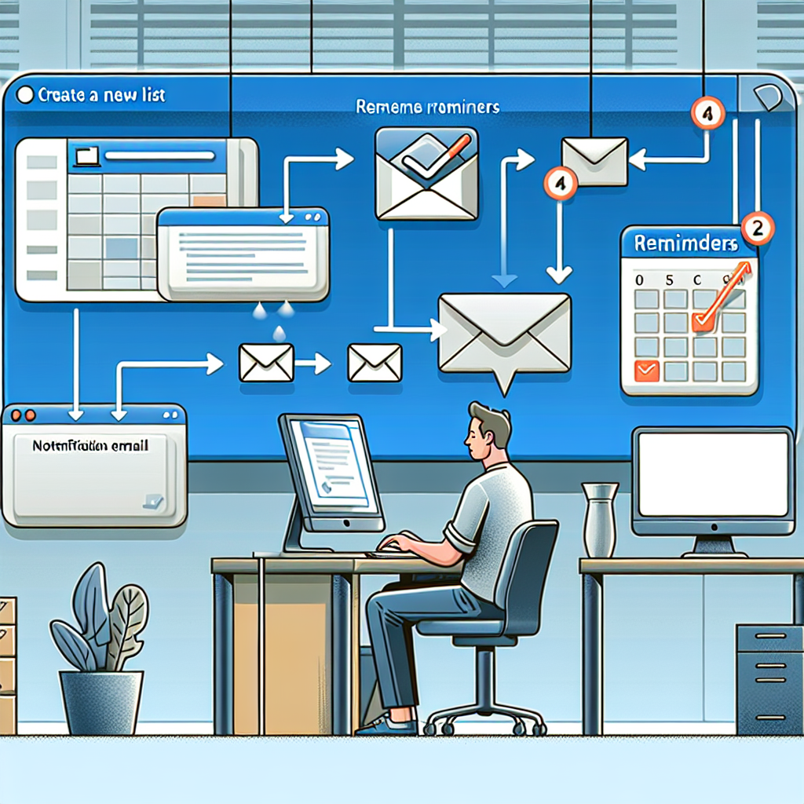

# Revolutionizing Task Reminders in SharePoint

Managing tasks effectively is crucial for maintaining productivity, especially for roles like service account managers who juggle numerous responsibilities. If you're using SharePoint, you may find yourself manually tracking feedback requests, monitoring deadlines, and following up on overdue tasks. While SharePoint offers tools for collaboration and communication, the manual processes can often accumulate, eating into valuable time. Let's explore a vision for simplifying this task management through automation, specifically by leveraging the Koksmat panel for streamlined reminders.

<!-- truncate -->

## Current Challenges with Manual Reminders

Consider the typical workflow: you manually send out reminder emails before and after deadlines, regularly check lists for overdue tasks, and try to maintain organization in SharePoint. Many professionals turn to tools like Power Automate and Power Flow to assist with these tasks. Despite their powerful capabilities, setting up complex automation flows can be time-consuming. Such efforts often require a deep dive into configurations, and future adjustments can become challenging if you're unable to recall the original setup.

## Introducing Koksmat Panel for Automation

Imagine a system where you can automate reminders with a simple click in your SharePoint workspace. With Koksmat, when you decide to activate a reminder email system, the process becomes significantly more efficient and less daunting.

Here’s how it works: with a single click, Koksmat can automatically create a SharePoint list to track your original tasks, set up another list to log sent emails, and prepare a third list with pre-defined email templates for both gentle and firm reminders. This integration allows an automation assistant to regularly monitor approaching deadlines, send the appropriate reminder emails, log these actions, and even update visual indicators directly in SharePoint.

## Setting Up Automated Reminder Emails

But what if the existing automation blocks don't quite meet your needs? Koksmat provides the flexibility to create custom automation blocks as GitHub projects. Whether your expertise lies in Python, PowerShell, Node.js, or Go, you can design tailored solutions inspired by available blocks—ensuring your automation fits your specific workflow requirements. Furthermore, you have the option to collaborate with Koksmat experts within your organization to refine these automations for robustness and scalability from the beginning.

## Custom Automation Solutions

Transitioning away from legacy tools such as Power Automate opens new horizons. Visualize a user-friendly interface, possibly crafted in React, which can generate the necessary automation effortlessly and intertwine seamlessly with other systems. This is the transformative vision for automating routine tasks: maintaining high quality from the outset while letting you focus on more significant tasks without the hassle of troubleshooting.

## Future Vision and Conclusion

Koksmat Automation's aim is to turn the tedious aspects of manual task management into a streamlined, efficient process. With a few simple clicks, you can implement a system capable of sending timely reminders, logging actions, and scaling according to your evolving needs. As we continue to develop and refine this system, we look forward to sharing more innovative updates that will inspire new approaches to your workflow.

Thank you for joining us today. We hope this exploration into automating task reminders with SharePoint and Koksmat sparks innovative ideas for your work. Stay tuned for more compelling insights and solutions in future discussions!
