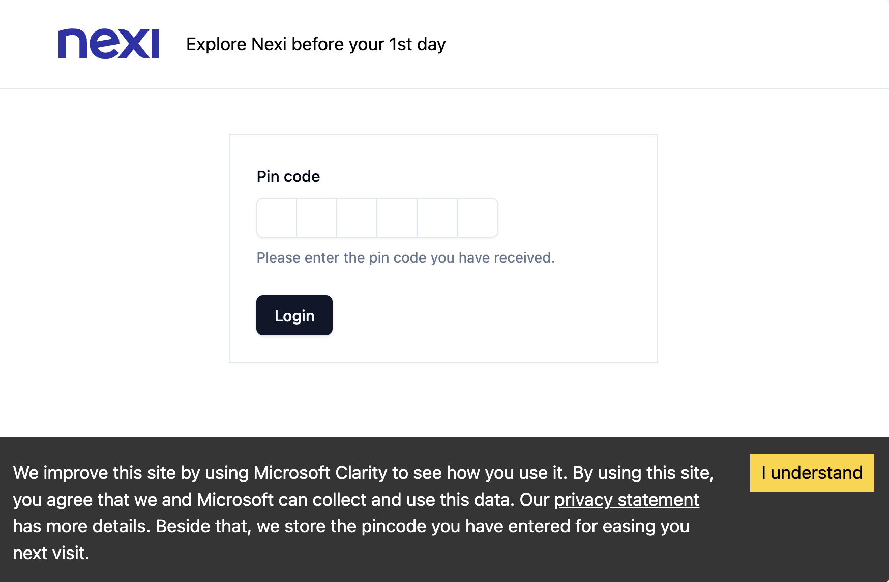

## Pre-Onboarding Process at Nexi

At Nexi, we believe that feeling prepared before your first day sets the foundation for a successful career with us. Our pre-onboarding platform allows you to explore essential tools, terms, and company information in a user-friendly environment. Below, we have provided a visual walkthrough of what you can expect during your pre-onboarding experience.

---

### 1. **Login Screen for Pre-Onboarding**

The first step in our pre-onboarding process is accessing the Nexi platform with a secure PIN. After receiving your PIN via email or SMS, you'll enter it on this screen to log in. This ensures a secure and personalized onboarding experience. The straightforward layout helps you seamlessly access important resources before your first day.

---

### 2. **Wiktionary: Glossary of Nexi Terms**

In the Nexi pre-onboarding, our "Wiktionary" section introduces you to key terminology you'll encounter in the payment processing industry. This is particularly helpful for those unfamiliar with the sector. Each term is clearly defined, with examples to ensure a solid understanding before starting your role. From "A2A" (Account-to-Account) payments to "PSP" (Payment Service Platform), these terms will become part of your daily work vocabulary at Nexi.

---

### 3. **Nexi Business Overview Page**

The Business Overview page provides a concise yet comprehensive introduction to Nexi's operations, services, and the payment ecosystem. This section is designed to help new hires understand Nexi’s role in the financial technology sector, covering everything from merchant services to card issuing solutions. This page is structured to give you a strong foundation of Nexi’s core business areas, helping you align with the company's mission and objectives from day one.

---

### 4. **Key Numbers Dashboard**

Our Key Numbers Dashboard offers insight into Nexi's performance, market reach, and financial data. This page is part of our commitment to transparency and helps new employees understand the scale and impact of the business. You'll find up-to-date metrics related to the number of transactions processed, geographic market reach, and other key performance indicators. These numbers give you a clear picture of Nexi's growth and success in the fintech space.

Here’s a concise explanation along with a Mermaid sequence diagram to visually represent the technical side:

---

## Technical Overview

The Nexi pre-onboarding platform is powered by a combination of modern web technologies and services to ensure seamless data management and display.

1. **Data Management in SharePoint**: The core onboarding content is maintained in **SharePoint Modern Pages**, which allows for structured content management within the Microsoft ecosystem.

2. **Data Processing via Magic-Pages Microservice**:

   - The **Magic-Pages** microservice is responsible for interacting with **Office Graph** to retrieve the necessary data from SharePoint.
   - This data is then filtered based on specific criteria before being stored in a **PostgreSQL** database for further use.

3. **Data Rendering with Next.js**: A **Next.js** application retrieves the filtered data from the Magic-Pages microservice and dynamically renders it for the pre-onboarding platform, ensuring a smooth and responsive user experience.

---

### Data publication

```mermaid
sequenceDiagram
    participant Magic-Pages Microservice
    participant Office Graph
    participant SharePoint
    participant PostgreSQL DB

    Magic-Pages Microservice->>Office Graph: Query SharePoint Data
    Office Graph->>SharePoint: Request Content Data
    SharePoint->>Office Graph: Return Content Data
    Office Graph->>Magic-Pages Microservice: Deliver Data
    Magic-Pages Microservice->>Magic-Pages Microservice: Filter Data
    Magic-Pages Microservice->>PostgreSQL DB: Store Filtered Data

```

### Data consumption

```mermaid
sequenceDiagram
    participant User
    participant NextJS App
    participant Magic-Pages Microservice
    participant PostgreSQL DB

    User->>NextJS App: Request Onboarding Content
    NextJS App->>Magic-Pages Microservice: Request Data
    Magic-Pages Microservice->>NextJS App: Return Filtered Data
    NextJS App->>User: Render Content
```

---

### Key Components:

- **SharePoint Modern Pages**: The primary repository for managing onboarding content.
- **Magic-Pages Microservice**: The middle layer that calls Office Graph, filters data, and stores it in PostgreSQL.
- **Next.js**: The frontend framework used to fetch and render the filtered data from the microservice.
- **PostgreSQL**: The database where the filtered data is stored. In our case a managed version in Azure
- **Kubernetes**: Hosted in our Azure

This setup ensures efficient data retrieval and dynamic content rendering for Nexi's pre-onboarding experience.

```mermaid
graph TB
    subgraph ExternalUser ["Internet"]
        User["User accessing sub-subdomains of Nexi"]
    end
    subgraph ExternalUser ["Intranet"]
        Editor["Editor accessing SharePoint"]
    end

    subgraph NexiPlatformBoundary ["Nexi Microsoft Cloud"]
        subgraph KubernetesCluster ["Kubernetes Cluster"]
            IngressController["Ingress Controller"]
            App1["Web (Docker: Nextjs)"]
            MagicPages["Worker (Docker: Go)"]


        end
        subgraph Azure ["Azure"]

            PostgreSQLDB["PostgreSQL Database"]

        end
        subgraph Microsoft365 ["Microsoft 365"]
            Graph["Office Graph"]
            SharePoint["SharePoint"]

        end

    end

    User -->|Access using anonymous access + pincode | IngressController
    Editor -->|Access using authenticated access| SharePoint
    IngressController --> App1
    App1 --> MagicPages
    MagicPages --> PostgreSQLDB
    Graph --> MagicPages
    SharePoint --> Graph


```
