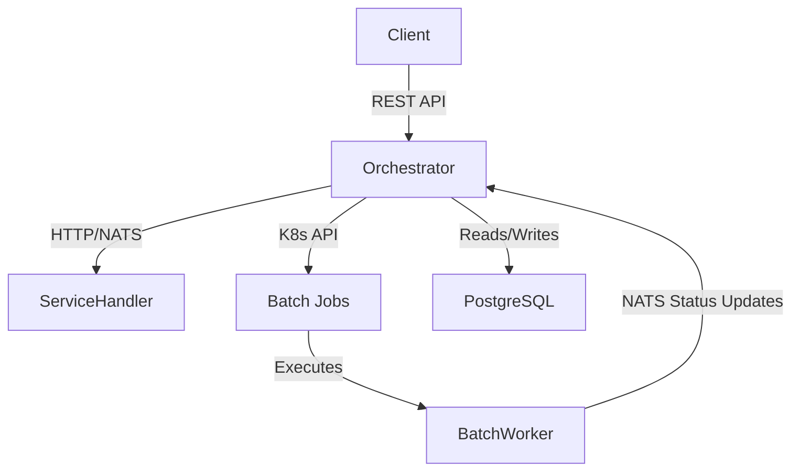
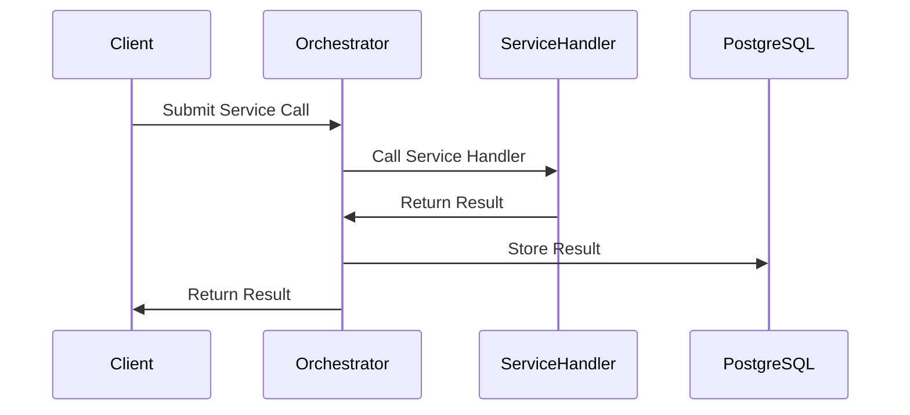
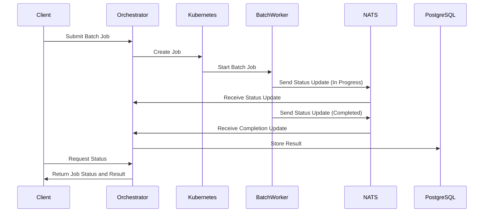
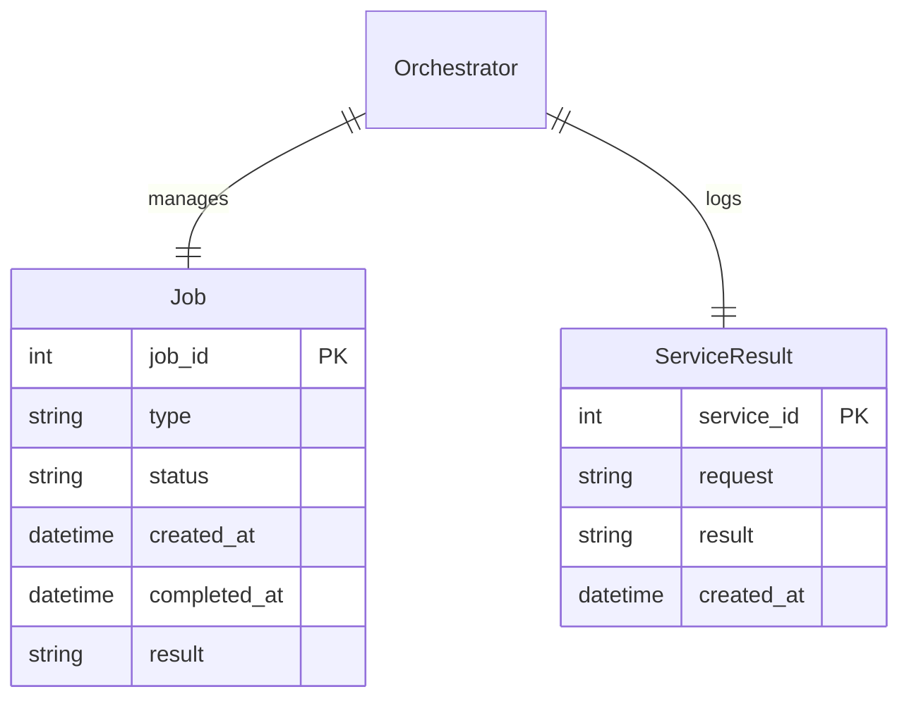
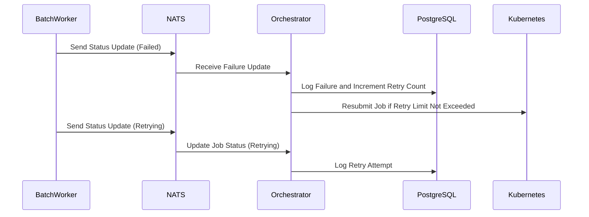

Here’s a structured Docusaurus markdown document with relevant Mermaid diagrams for your process orchestration system using PostgreSQL as the backend. I’ve included infrastructure and sequence diagrams, and I'll wrap it in Docusaurus frontmatter and headings for easy integration.

```md
---
id: process-orchestration-architecture
title: Process Orchestration Architecture
description: High-level architecture for process orchestration using Go, NATS, Kubernetes, and PostgreSQL as backend.
---

# Process Orchestration Architecture

This document outlines the architecture of the process orchestration system using Go, NATS, Kubernetes, and PostgreSQL as the backend for managing both synchronous service calls and asynchronous batch jobs.

## 1. Infrastructure Overview

The system is built on Kubernetes as the platform to manage both processes and services. NATS is used for message-based communication, while PostgreSQL is the persistent backend for tracking job statuses and storing results.

### 1.1 Infrastructure Diagram



**Components**:
- **Client**: Initiates both service calls and batch jobs via the REST API.
- **Orchestrator**: The main Go service managing the lifecycle of both services and batch jobs.
- **Service Handler**: Stateless microservices handling synchronous tasks.
- **Kubernetes**: Manages asynchronous batch jobs using Kubernetes Jobs.
- **Batch Worker**: Executes long-running tasks asynchronously and reports results back to the orchestrator.
- **PostgreSQL**: Stores job statuses, results, and logs.

## 2. Sequence Diagrams

This section illustrates the flow of both service calls and batch job executions.

### 2.1 Service Call Flow



1. The client submits a synchronous service call to the orchestrator.
2. The orchestrator forwards the call to the service handler.
3. The service handler processes the request and returns the result.
4. The orchestrator stores the result in PostgreSQL for logging or future reference.
5. The orchestrator returns the result to the client.

### 2.2 Batch Job Flow



1. The client submits a batch job request to the orchestrator.
2. The orchestrator creates a Kubernetes job for the batch worker.
3. Kubernetes schedules and starts the batch job.
4. The batch worker sends status updates (e.g., "in progress") via NATS.
5. The orchestrator updates PostgreSQL with the job's status and listens for completion updates via NATS.
6. Once the batch job is completed, the result is stored in PostgreSQL.
7. The client can query the orchestrator for job status, and the orchestrator returns the result if available.

## 3. Database Schema

PostgreSQL will store both service call results and batch job metadata. Below is a conceptual diagram of the database schema.

### 3.1 Database Schema Diagram



- **Job Table**: Tracks asynchronous batch jobs. Stores job ID, type, status, timestamps, and result.
- **ServiceResult Table**: Stores results of synchronous service calls, including the request data and the result.

## 4. Error Handling and Job Retries

Batch jobs may fail or require retries. This section outlines how errors are handled and how the system tracks retries.

### 4.1 Error Handling Flow



1. If a batch job fails, the worker sends a failure update via NATS.
2. The orchestrator logs the failure in PostgreSQL and increments the retry count.
3. If the retry limit is not exceeded, the job is resubmitted via Kubernetes.
4. The retry attempt is logged in PostgreSQL, and the process continues until success or retry limit is reached.

---

This document provides a comprehensive high-level view of the architecture for your process orchestration system, integrating Go, NATS, Kubernetes, and PostgreSQL.
```

This markdown file is ready for integration into Docusaurus. The Mermaid diagrams show the flow for service calls and batch jobs, and the PostgreSQL schema gives a visual overview of the database structure.

Would you like further modifications or additional diagrams?
